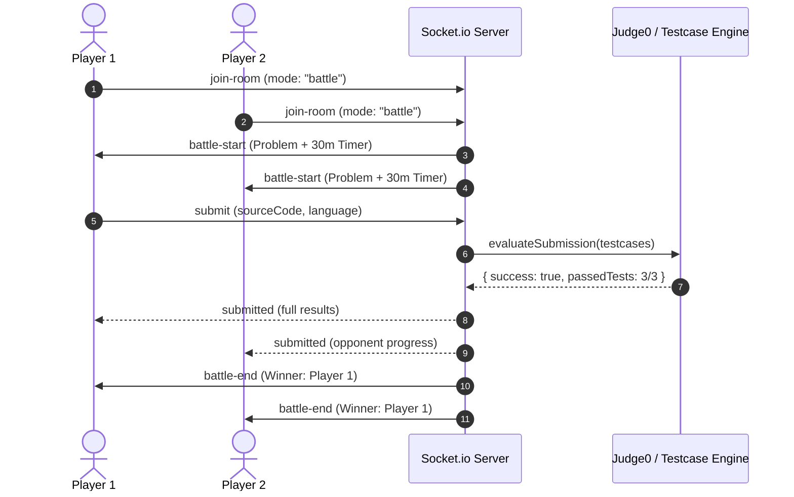

<div align="center">

  

  # CODDAB

  **Real-Time Collaborative Code Editor & 1v1 Algorithmic Battle Arena**

  [](https://reactjs.org/)
  [](https://nodejs.org/)
  [](https://socket.io/)
  [](https://judge0.com/)
  [](https://deepmind.google/technologies/gemini/)

  <br />

  <p align="center">
    A high-performance workspace engineered for pair programming, synchronized code rooms, live head-to-head coding battles, and automated AI code evaluations.
  </p>

</div>

---

## ⚡ Overview

**CODDAB** bridges real-time pair programming and competitive coding into a seamless, dark-mode-first developer experience. Whether collaborating on algorithms with your team or going head-to-head in timed 1v1 coding face-offs, CODDAB provides synchronized execution, automated testcase evaluation, and instant AI insights.

---

## ✨ Key Features

### ⚔️ 1v1 Battle Arena
- **Synchronized Matchmaking**: Jump into private rooms with instant countdowns and synchronized battle clocks.
- **Dynamic Problem Generation**: Randomized algorithmic challenges curated with testcase suites.
- **Live Opponent Tracker**: Receive real-time socket updates as your opponent runs or submits code.
- **Battle Resolution Engine**: Automated testcase evaluation triggers instant victory screen and match breakdown upon accepted solution.

### 👥 Collaborative Workspace
- **Real-Time Code Sync**: Sub-millisecond code synchronization powered by Socket.io and CodeMirror.
- **Multi-User Presence**: Active user list with online indicators and room participant awareness.
- **Customizable Environment**: Font resizing, code clearing, and multi-language template switching.

### 🧠 AI-Powered Code Review
- **Automated Complexity Analysis**: Evaluates Time & Space complexity ($O(N)$, $O(1)$, etc.) on demand.
- **Edge Case Detection**: Identifies unhandled boundary conditions and potential runtime pitfalls.
- **Actionable Optimization**: Structured feedback highlighting code cleanliness, performance, and best practices.

### 🚀 Remote Code Execution (Judge Engine)
- **Isolated Sandbox Execution**: Runs untrusted code safely against standard input/output.
- **Testcase Suite Runner**: Validates algorithmic correctness against hidden and sample test cases with pass/fail metrics.

---

## 🛠️ Tech Stack

| Layer | Technologies |
| :--- | :--- |
| **Frontend** | React 19, Vite, CodeMirror, CSS Modules, Lucide Icons, React Hot Toast |
| **Styling & Shaders** | Custom Modern CSS Design System, WebGL/Shader UI Cards, Glassmorphism |
| **Backend & API** | Node.js, Express.js (v5), MongoDB, Mongoose, Zod Validation |
| **Realtime Engine** | Socket.io (Bi-directional room channels & state broadcasting) |
| **Code Judge** | Judge0 API (Remote Sandbox Compiler & Testcase Evaluator) |
| **AI Engine** | Google Gemini API (Algorithmic & Code Quality Review) |

---

## 📂 Project Architecture

```plaintext
Coddab/
├── client/                     # Frontend Application
│   ├── public/                 # Static assets & brand SVG logos
│   └── src/
│       ├── components/ui/      # Shaders, ripple effects, typography loops
│       ├── Pages/
│       │   ├── Home/           # Hero, feature showcase, interactive app mockup
│       │   ├── JoinPage/       # Room creation & direct join gateway
│       │   ├── EditorPage/     # Collab editor, problem panel, AI review modal
│       │   ├── BattleResult/   # Winner announcement & battle recap
│       │   └── Login/Signup/   # Auth portal
│       ├── socket.js           # Central socket client instance
│       └── Actions.js          # Shared socket event constants
│
└── server/                     # Backend API & Realtime Server
    └── src/
        ├── controllers/        # Judge & AI review controllers
        ├── routes/             # REST endpoints (/judge, /ai, /auth)
        ├── services/           # Testcase runner & Gemini AI integrations
        ├── sockets/            # Room handlers & battle lifecycle state
        ├── data/               # Algorithmic problem bank & test cases
        └── utils/              # JWT verification & token helpers
```

---

## 🚀 Quick Start

### Prerequisites
- **Node.js**: `v18.0.0` or higher
- **npm** or **pnpm**
- **MongoDB** instance (Local or Atlas)
- **Judge0 API Key** (RapidAPI or Self-hosted)
- **Gemini API Key**

---

### 1. Clone the Repository
```bash
git clone https://github.com/krishdarji2005/CODDAB.git
cd CODDAB
```

---

### 2. Configure Environment Variables

#### Server (`server/.env`)
```env
PORT=5000
MONGODB_URI=your_mongodb_connection_string
JWT_SECRET=your_jwt_secret_key
JUDGE0_API_KEY=your_rapidapi_judge0_key
JUDGE0_API_HOST=judge0-ce.p.rapidapi.com
GEMINI_API_KEY=your_google_gemini_api_key
```

#### Client (`client/.env`)
```env
VITE_BACKEND_URL=http://localhost:5000
```

---

### 3. Install Dependencies & Run

#### Start Backend Server
```bash
cd server
npm install
npm run dev
```

#### Start Frontend Client
```bash
cd ../client
npm install
npm run dev
```

Access the application at `http://localhost:5173`.

---

## 📡 Real-Time Socket Flow



---

## 🛡️ License

This project is licensed under the [ISC License](LICENSE).
